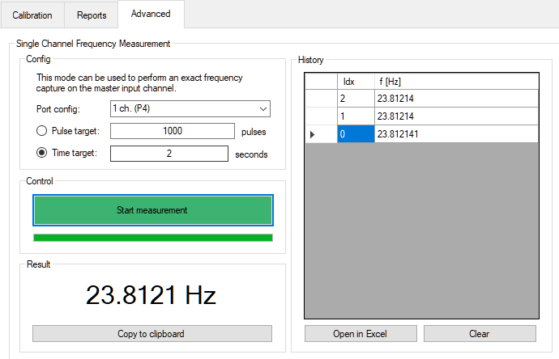

# Advanced features

## :material-professional-hexagon:  Independent frequency measurement



### What is it?

Under the ```Advanced``` tab you will find the **Independent frequency measurement** mode. This mode allows you to measure the frequency of one input channel independent of the DUT channel and without further flowrate calculations. In contrast to the instanteneous frequency value that is displayed in the live graph is that in this mode the number of pulses or a time limit can be selected. 

This mode can be used to measure the repeatability of the frequency values or flowmeter.

!!! info "Master-only"
    To use this mode, connect the flowmeter or speed sensor to the master input. The DUT input is _not_ used here.


### Usage

To setup this mode, you first need to configure the port to match the signal type that is applied to the master input. You can select between a `Dual channel (quadrature)` input or a `Single channel` input.

In the next step, you need to specify the pulse limit that stops the measurement. This limit stops the measurement after the specified number of pulses have been measured. If alternatively the time limit is selected, the measurement will stop roughly after the specified time. 

??? example "Time limit internal workings"
    The number of expected pulses is internally calculated using the frequency at the start of the measurement and used the same way as the pulse limit. 

Start the measurement by pressing the `START` button. 

After the measurement is finished, the result will be displayed in the results field and also added to the history table. The table can later be exported into an Excel sheet if desired.