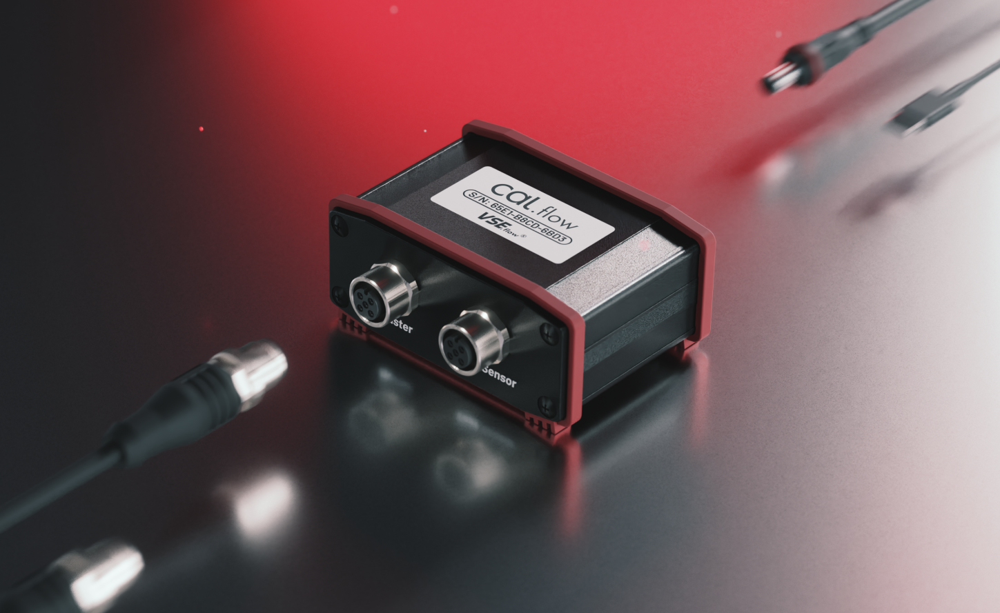
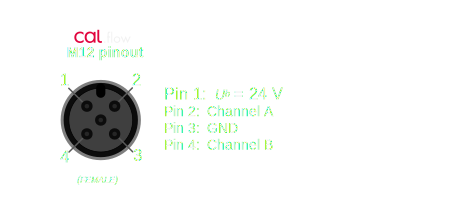
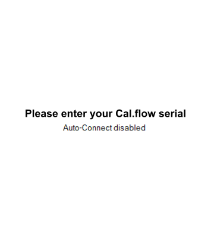
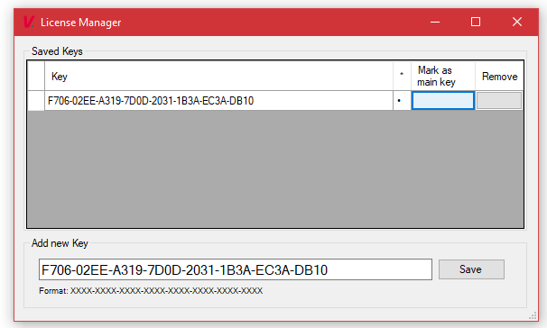

# Program features and basics

## Basic setup

### :material-heating-coil: Hydraulic schematic

To build a calibration setup using the reference calibration principle, you need a master flowmeter with an existing calibration protocol and a test flowmeter (called DUT). A sample setup is shown in the following image. A hydraulic pump is pumping the calibration fluid through both flowmeters which are connected in series so that the flowrate through both flowmeters is always equal. The flowrate needs to be adjustable, for example using a constant pump in conjunction with a pressure relief valve and a throttle valve or using a pump with adjustable speed (e.g. frequency inverter). Please also note that the flowmeters should never used without backpressure at the output. For this purpose, a suitable check valve can be used.

<figure markdown>
  
  <figcaption>Hydraulic schematic for reference calibration principle</figcaption>
</figure>

### :material-power-plug: Connection of the Cal.flow

The Cal.flow is the interface between the flowmeters and the calibration software, which runs on a computer. The quadrature (or single channel) signals will be accurately measured in order to calculate the K-Factor for each measurement point.
The connections on the device are two female M12 A-coded connectors, an USB-C port and an optional DC-power jack. 

 | 
--- | ---
Cal.flow: Flowmeter M12 Connections | Cal.flow: Flowmeter Auxilary Connections

#### M12 input signals

To connect the flowmeters, two 2m M12 connection cables are included. 

* Push-Pull preamplifier outputs and PNP outputs work out of the box without external components
* NPN outputs need an additional external pull-up resistor on the output line before the signals can be correctly measured 

Not only VSE flowmeters can be calibrated. Any quadrature based signal can be measured with the Cal.flow. Before connecting the flowmeter, check the correct pinout. Please refer to the diagram below:

!!! danger inline end "Ensure correct pinout" 
    It is the user's responsibility to ensure the correct pin assignment of the connected flowmeter. Incorrect connections may result in electrical damage to the Cal.flow or flowmeter.



#### PC connection

For the PC connection you can use the included USB-C to USB A cable or any other USB-C Cable you have on hand. These connections are mandatory.

#### DC power jack

The DC-power jack is optional because the Cal.flow has an internal 5V to 24V voltage booster, which can be used to power the flowmeters. If the total current draw from the flowmeters exceeds 50 mA, an external power supply has to be used to not damage or overheat the Cal.flow device. Another option is to use a T-junction M12 connector on one of the flowmeter ports to inject a existing 24V supply voltage externally (e.g. from the testbench). The voltage will then be passed through to the other flowmeter.

### :material-monitor: Connection to the PC software

If you read this step, the software is probably already installed. The Cal.flow is automatically identified by the PC upon connection and should be shown as a virtual COM port in the device manager (VCP). If the device is not automatically installed, please install the [FTDI drivers](https://ftdichip.com/drivers/vcp-drivers/) :material-link:.

The EasyCal software automatically scans for a Cal.flow device and starts the connection procedure.

## Program features

This chapter shows an overview of all available features ordered by the pages in the tab drawer. Every feature will be described to explain its specific function.

The program consists of multiple tab pages that can be switched using the headers on the top. Additional program settings and file save/open options can be found in the [menu bar](basics.md#menu-bar). On the first connection the program will start on the [connection page](basics.md#connection-page). 

Before first use, the Cal.flow needs to be activated with a serial key. If the program was started the first time and no serial number was entered yet, use the [license manager](basics.md#license-manager) to store the serial number in the program. 

If the key is set and the Cal.flow is connected via USB. The connection should be established automatically. The serial number of the Cal.flow is then displayed in the bottom statusbar. 
<figure markdown>
  
  <figcaption>Bottom statusbar with connection status</figcaption>
</figure>

### :material-menu-open:  Menu Bar 
The menu bar offers multiple options to configure the software.

 
#### File menu


* __Open Result file__ :octicons-arrow-right-16: Import .csv file with calibration results and add them to the calibration report result selector.
* __Open Appdata folder__ :octicons-arrow-right-16: Open the Appdata folder containing all saved presets and program settings. If you want to delete presets, you can manually delete them in the folder structure here.
* __Open calibration *.zip__  :octicons-arrow-right-16: Opens a ZIP archive containing calibration presets and results and imports them all. The presets will be added to the preset selectors and the result to the result selector. The presets will be permanently added.
* __Open calibration *.zip__  :octic

#### License Management menu


* __Status: ...__ :octicons-arrow-right-16: Displays the current Cal.flow connection and activation status. The status will stay unactivated until a Cal.flow is connected and the key is verified.
* __Open License Manager__ :octicons-arrow-right-16: Open the [license manager](basics.md#license-manager) to save new serial keys and manage existing ones. Multiple Cal.flow keys can be added. The one used is chosen by the _main key_ flag.

#### Help / Documentation menu


Pressing this button opens this documentation in the default browser.

### :octicons-tab-external-16:  Tab Pages
Depending on the Cal.flow connection state, different tab pages will be shown. 
Without any connection, the user can only load existing calibration results.

 

#### Preset-based calibration configuration
Most of the calibration configuration is preset based. This means that all fields of a certain groupbox can be saved and restored using the corresponding buttons. This is for example useful if you have a few masters on hand that you want to specify once and later use again. Also company internal standards for measurement specifications can be saved so that all calibrations are based on the same settings. The presets are stored in the Appdata directory (which can be manually opened using the [file menu](program.md#file-menu)) and are automatically imported on program start. 

??? question "Manage presets"
    If you want to manage your presets or delete some of them, use the appdata folder to browse all presets and delete the corresponding `*.xml`-Files

#### :material-connection:  Connection page

The connection page is the first page being shown on program startup. It is hidden once a device is connected.

<figure markdown>
  
  <figcaption>Connection page with no device connected</figcaption>
</figure>

* If no serial was entered yet, a message is displayed and you need to use the [license manager](basics.md#license-manager) to add the key.
* If the serial is already saved, the "please connect" message is shown and you need to connect the Cal.flow using the included USB-C cable to the PC. If the Cal.flow is not automatically recognized, please refer to [this](basics.md#connection-to-the-pc-software) section for driver installation information. 
* Normally, the Cal.flow will be automatically recognized and the [master setup page](program.md#master-setup) will be shown. 
* Alternatively you can import a result file or calibration package using the options in the [file menu](basics.md#file-menu) without a device connection in order to generate a report or export the data.

<figure markdown>
  
  <figcaption>Status bar with connected Cal.flow</figcaption>
</figure>

Once connected, the bottom status bar will turn green and the Cal.flow serial number is displayed. Futhermore the live data stream for the plots is now active in the right-hand window.

## :material-chart-scatter-plot-hexbin:  Live Plots


The flowrate / frequency of both connected flowmeters is continuously monitored and presented in the rightmost panels. The top panel shows the masters flowrate. Below it, the DUT's frequency is shown. 

To display correct and plausible values, the flowmeters must be properly configured using the [calibration setup](program.md). 

Using the sliders on top of the plots, the plot's filter dynamics can be adjusted. A lower filter value will yield in a faster and noisier frequency visualization - a higher filter value smoothes out the frequency. Refer to the following table for rise times of the filter:

Rise time [ms] | Filter Setting
--- | ---
1 | 0
20 | 1
150 | 2
800 | 3
2000 | 4
5000 | 5

The sample rate adjusts, how fast the frequency value are requested from the cal.flow. A higher sample rate will result in a higher refresh rate and smoother display. At the same time the effective displayed history duration will be shortened. So if you want to see a longer history, a lower sample rate should be chosen.  


## :octicons-key-16:  License Manager

The license manager allows the user to add one or multiple Cal.flow serial numbers. Enter the serial key that you got on purchase via mail and press `Save`. The serial number that the program should use has to be selected with the `mark as main key` button. The software can only connect to one Cal.flow device at a time. The connection will always be established with the main key. 

A new key can be added by entering the full serial number into the key field and pressing ```Save```. 

!!! warning "Mark as main key"
    Dont forget to mark the new key as the main key using the button in the table so that the "dot" next to the key is visible.

 | 
--- | ---
Message on connection page if no serial was entered | Entering of serial key and selecting as main key

