# Programmfunktionen und Grundlagen

## Grundeinstellung

### :material-heating-coil: Hydraulisches Schema

Um einen Kalibrierungsaufbau nach dem Referenzkalibrierungsprinzip zu erstellen, benötigen Sie einen Master-Volumensensor mit einem bestehenden Kalibrierungsprotokoll und einen Test-Volumensensor (genannt DUT). Das folgende Bild zeigt ein Beispiel für einen solchen Aufbau. Eine Hydraulikpumpe pumpt die Kalibrierflüssigkeit durch beide Volumensensoren, die in Reihe geschaltet sind, so dass der Durchfluss durch beide Volumensensoren immer gleich ist. Der Durchfluss muss einstellbar sein, z. B. mit einer Konstantpumpe in Verbindung mit einem Überdruckventil und einem Drosselventil oder mit einer Pumpe mit einstellbarer Drehzahl (z. B. Frequenzumrichter). Bitte beachten Sie auch, dass die Volumensensoren nie ohne Gegendruck am Ausgang eingesetzt werden sollten. Zu diesem Zweck kann ein geeignetes Rückschlagventil verwendet werden.

<figure markdown>
  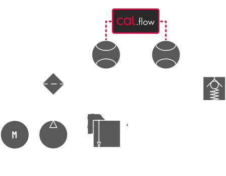
  <figcaption>Hydraulikschema für das Prinzip der Referenzkalibrierung</figcaption>
</figure>

### :material-power-plug: Anschluss des Cal.flow

Der Cal.flow ist die Schnittstelle zwischen den Volumensensoren und der Kalibriersoftware, die auf einem Computer läuft. Die Quadratursignale (oder Einkanalsignale) werden genau gemessen, um den K-Faktor für jeden Messpunkt zu berechnen.
Die Anschlüsse am Gerät sind zwei M12-A-Buchsen, ein USB-C-Anschluss und eine optionale DC-Stromversorgungsbuchse. 

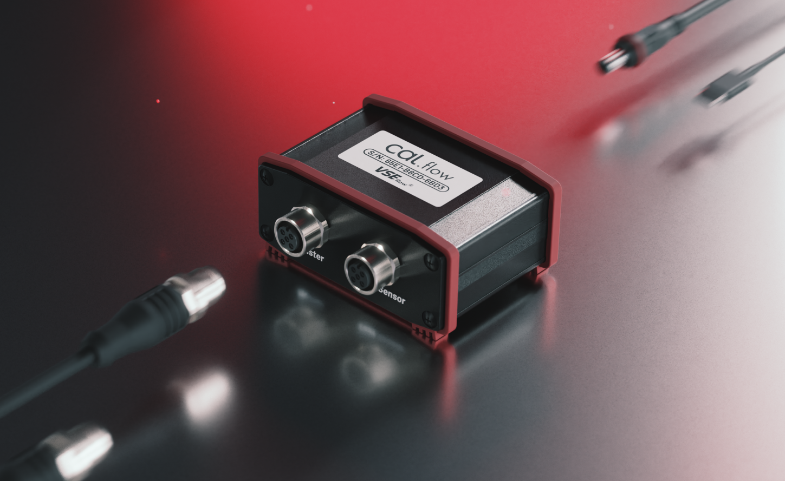 | 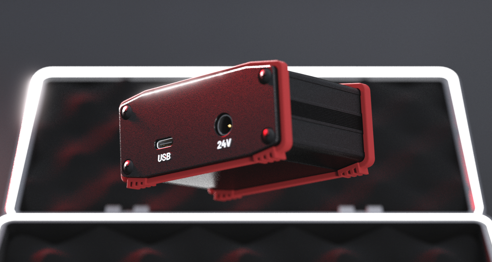
--- | ---
Cal.flow: Volumensensor M12-Anschlüsse | Cal.flow: Volumensensor Auxilary Connections

#### M12-Eingangssignale {id="m12-input-signals"}

Für den Anschluss der Volumensensoren sind zwei 2 m lange M12-Anschlusskabel im Lieferumfang enthalten. 

* Push-Pull Vorverstärkerausgänge und PNP-Ausgänge funktionieren ohne externe Komponenten.
* NPN-Ausgänge benötigen einen zusätzlichen externen Pull-up-Widerstand auf der Ausgangsleitung, bevor die Signale korrekt gemessen werden können. 

Es können nicht nur Volumensensoren von VSE kalibriert werden. Jedes quadraturbasierte Signal kann mit dem Cal.flow gemessen werden. Bevor Sie den Volumensensor anschließen, überprüfen Sie die korrekte Pinbelegung. Bitte beachten Sie das unten stehende Diagramm:

!!! Gefahr inline end "Richtige Pinbelegung sicherstellen" 
    Es liegt in der Verantwortung des Benutzers, die korrekte Pinbelegung des angeschlossenen Volumensensors sicherzustellen. Falsche Anschlüsse können zu einer elektrischen Beschädigung des Cal.flow oder Volumensensors führen.

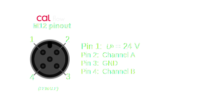

#### PC-Anschluss

Für den PC-Anschluss können Sie das mitgelieferte USB-C-auf-USB-A-Kabel oder ein anderes USB-C-Kabel verwenden, das Sie zur Hand haben. Diese Anschlüsse sind obligatorisch.

#### DC-Stromversorgungsbuchse

Die DC-Stromversorgungsbuchse ist optional, da der Cal.flow über einen internen Spannungsbooster von 5 V auf 24 V verfügt, der für die Stromversorgung der Volumensensoren verwendet werden kann. Wenn die Gesamtstromaufnahme der Volumensensoren 50 mA übersteigt, muss eine externe Stromversorgung verwendet werden, um das Cal.flow-Gerät nicht zu beschädigen oder zu überhitzen. Eine andere Möglichkeit ist die Verwendung eines T-Verteiler-M12-Steckers an einem der Anschlüsse des Volumensensors, um eine bestehende 24-V-Versorgungsspannung von außen (z. B. von der Testbench) einzuspeisen. Die Spannung wird dann an den anderen Volumensensor weitergeleitet.

### :material-monitor: Anschluss an die PC-Software {id="connection-to-the-pc-software"}

Wenn Sie diesen Schritt lesen, ist die Software wahrscheinlich bereits installiert. Der Cal.flow wird beim Anschluss automatisch vom PC erkannt und sollte als virtueller COM-Port im Gerätemanager (VCP) angezeigt werden. Wenn das Gerät nicht automatisch installiert wird, installieren Sie bitte die [FTDI-Treiber](https://ftdichip.com/drivers/vcp-drivers/) :material-link:.

Die EasyCal-Software sucht automatisch nach einem Cal.flow-Gerät und startet den Verbindungsvorgang.

## Programmfunktionen

In diesem Kapitel finden Sie eine Übersicht über alle verfügbaren Funktionen, geordnet nach den Seiten in der Registerkarte Schublade. Jede Funktion wird beschrieben, um ihre spezifische Funktion zu erklären.

Das Programm besteht aus mehreren Registerkarten, die über die Kopfzeilen am oberen Rand umgeschaltet werden können. Weitere Programmeinstellungen und Optionen zum Speichern/Öffnen von Dateien finden Sie in der [Menüleiste](basics.md#menu-bar). Bei der ersten Verbindung wird das Programm auf der [Verbindungsseite](basics.md#connection-page) gestartet. 

Vor der ersten Benutzung muss der Cal.flow mit einem Serienschlüssel aktiviert werden. Wenn das Programm zum ersten Mal gestartet wurde und noch keine Seriennummer eingegeben wurde, verwenden Sie den [license manager](basics.md#license-manager), um die Seriennummer im Programm zu speichern. 

Wenn der Schlüssel gesetzt ist und der Cal.flow über USB angeschlossen ist. Die Verbindung sollte automatisch hergestellt werden. Die Seriennummer des Cal.flow wird dann in der unteren Statusleiste angezeigt. 
<figure markdown>
  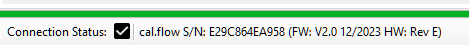
  <figcaption>Untere Statusleiste mit Verbindungsstatus</figcaption>
</figure>

### :material-menu-open:  Menüleiste {id="menu-bar"}
Die Menüleiste bietet zahlreiche Optionen zur Konfiguration der Software.

 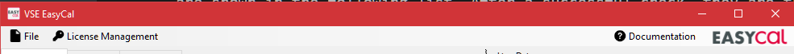
#### Menü Datei {id="file-menu"}
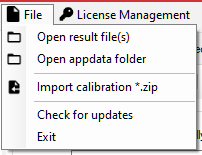

* __Open Result file__ :octicons-arrow-right-16: Importieren Sie eine .csv-Datei mit Kalibrierungsergebnissen und fügen Sie sie dem Ergebnisselektor des Kalibrierungsberichts hinzu.
* __Open Appdata folder__ :octicons-arrow-right-16: Öffnen Sie den Ordner "Appdata", der alle gespeicherten Voreinstellungen und Programmeinstellungen enthält. Wenn Sie Voreinstellungen löschen möchten, können Sie sie hier manuell in der Ordnerstruktur löschen.
* __Kalibrierung öffnen *.zip__ :octicons-arrow-right-16: Öffnet ein ZIP-Archiv mit Kalibrierungsvoreinstellungen und -ergebnissen und importiert sie alle. Die Voreinstellungen werden zu den Voreinstellungsselektoren und die Ergebnisse zu den Ergebnisselektoren hinzugefügt. Die Voreinstellungen werden dauerhaft hinzugefügt.
* __Kalibrierung öffnen *.zip__ :octic

#### Menü Lizenzverwaltung
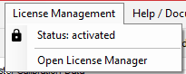

* __Status: ...__ :octicons-arrow-right-16: Zeigt den aktuellen Cal.flow-Verbindungs- und Aktivierungsstatus an. Der Status bleibt so lange unaktiviert, bis ein Cal.flow angeschlossen und der Schlüssel verifiziert ist.
* __Öffnen des Lizenzmanagers__ :octicons-arrow-right-16: Öffnen Sie den [Lizenzmanager](basics.md#license-manager), um neue Serienschlüssel zu speichern und vorhandene zu verwalten. Es können mehrere Cal.flow-Schlüssel hinzugefügt werden. Der verwendete Schlüssel wird durch das Flag _main key_ ausgewählt.

#### Menü Hilfe / Dokumentation
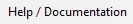

Durch Drücken dieser Schaltfläche wird die Dokumentation im Standardbrowser geöffnet.

### :octicons-tab-external-16:  Registerkarten
Je nach Cal.flow-Verbindungsstatus werden unterschiedliche Registerkarten angezeigt. 
Ohne Verbindung kann der Benutzer nur vorhandene Kalibrierungsergebnisse laden.

 

#### Voreinstellungsbasierte Kalibrierungskonfiguration
Der größte Teil der Kalibrierungskonfiguration ist voreingestellt. Das bedeutet, dass alle Felder eines bestimmten Gruppenfeldes über die entsprechenden Schaltflächen gespeichert und wiederhergestellt werden können. Dies ist z. B. nützlich, wenn Sie einige Master zur Hand haben, die Sie einmal festlegen und später wieder verwenden möchten. Auch firmeninterne Standards für Messvorgaben können gespeichert werden, so dass alle Kalibrierungen auf den gleichen Einstellungen beruhen. Die Voreinstellungen werden im Appdata-Verzeichnis gespeichert (das über das [Datei-Menü](basics.md#file-menu) manuell geöffnet werden kann) und werden beim Programmstart automatisch importiert. 

Frage "Voreinstellungen verwalten"
    Wenn Sie Ihre Voreinstellungen verwalten oder einige von ihnen löschen möchten, verwenden Sie den appdata-Ordner, um alle Voreinstellungen zu durchsuchen und die entsprechenden `*.xml`-Dateien zu löschen

#### :material-connection:  Verbindungsseite {id="connection-page"}

Die Verbindungsseite ist die erste Seite, die beim Start des Programms angezeigt wird. Sie wird ausgeblendet, sobald ein Gerät angeschlossen ist.

<figure markdown>
  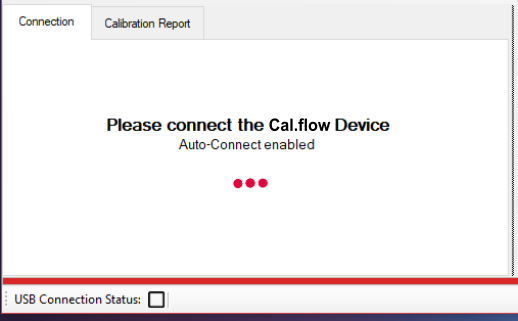
  <figcaption>Verbindungsseite, wenn kein Gerät angeschlossen ist</figcaption>
</figure>

* Wenn noch keine Seriennummer eingegeben wurde, wird eine Meldung angezeigt und Sie müssen den [Lizenzmanager](basics.md#license-manager) verwenden, um den Schlüssel hinzuzufügen.
* Wenn die Seriennummer bereits gespeichert ist, wird die Meldung "Bitte verbinden" angezeigt und Sie müssen das Cal.flow mit dem mitgelieferten USB-C-Kabel an den PC anschließen. Wenn das Cal.flow nicht automatisch erkannt wird, lesen Sie bitte [diesen Abschnitt](basics.md#connection-to-the-pc-software) für Informationen zur Treiberinstallation. 
* Normalerweise wird der Cal.flow automatisch erkannt und die [Master-Setup-Seite](program.md#master-setup) wird angezeigt. 
* Alternativ können Sie eine Ergebnisdatei oder ein Kalibrierungspaket über die Optionen im [Datei-Menü](basics.md#file-menu) ohne Geräteverbindung importieren, um einen Bericht zu erstellen oder die Daten zu exportieren.

<figure markdown>
  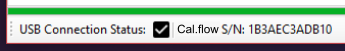
  <figcaption>Statusleiste mit angeschlossenem Cal.flow</figcaption>
</figure>

Sobald die Verbindung hergestellt ist, wird die untere Statusleiste grün und die Cal.flow-Seriennummer wird angezeigt. Außerdem ist jetzt der Live-Datenstrom für die Plots im rechten Fenster aktiv.

## :material-chart-scatter-plot-hexbin:  Live-Plots


Die Durchflussrate/Frequenz der beiden angeschlossenen Volumensensoren wird kontinuierlich überwacht und in den Feldern ganz rechts dargestellt. Das obere Feld zeigt die Master-Durchflussrate. Darunter wird die Frequenz des Prüflings angezeigt. 

Um korrekte und plausible Werte anzuzeigen, müssen die Volumensensoren mit Hilfe des [calibration setup](program.md) richtig konfiguriert werden. 

Mit den Schiebereglern über den Diagrammen kann die Filterdynamik des Diagramms angepasst werden. Ein niedrigerer Filterwert führt zu einer schnelleren und lauteren Frequenzdarstellung - ein höherer Filterwert glättet die Frequenz. Die Anstiegszeiten des Filters können Sie der folgenden Tabelle entnehmen:

Anstiegszeit [ms] | Filtereinstellung
--- | ---
1 | 0
20 | 1
150 | 2
800 | 3
2000 | 4
5000 | 5

Die Abtastrate stellt ein, wie schnell die Frequenzwerte vom cal.flow abgefragt werden. Eine höhere Abtastrate führt zu einer höheren Aktualisierungsrate und einer flüssigeren Anzeige. Gleichzeitig wird die effektiv angezeigte Verlaufsdauer verkürzt. Wenn Sie also einen längeren Verlauf sehen möchten, sollten Sie eine niedrigere Abtastrate wählen.  


## :octicons-key-16:  Lizenz-Manager {id="license-manager"}

Der Lizenzmanager ermöglicht es dem Benutzer, eine oder mehrere Cal.flow-Seriennummern hinzuzufügen. Geben Sie den Serienschlüssel ein, den Sie beim Kauf per Post erhalten haben, und drücken Sie auf `Speichern`. Die Seriennummer, die das Programm verwenden soll, muss mit der Schaltfläche "Als Hauptschlüssel markieren" ausgewählt werden. Die Software kann sich immer nur mit einem Cal.flow-Gerät verbinden. Die Verbindung wird immer mit dem Hauptschlüssel hergestellt. 

Ein neuer Schlüssel kann hinzugefügt werden, indem die vollständige Seriennummer in das Schlüsselfeld eingegeben und ```Speichern`` gedrückt wird. 

!!! Warnung "Als 'main-key' markieren"
    Vergessen Sie nicht, den neuen Schlüssel mit der Schaltfläche in der Tabelle als Hauptschlüssel zu markieren, so dass der "Punkt" neben dem Schlüssel sichtbar ist.

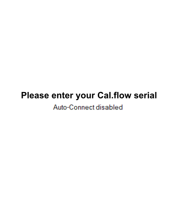 | 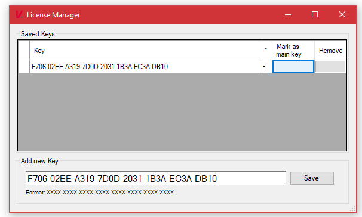
--- | ---
Meldung auf der Verbindungsseite, wenn keine Seriennummer eingegeben wurde | Eingabe des Serienschlüssels und Auswahl als Hauptschlüssel
