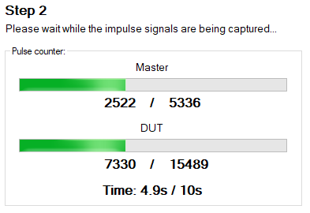
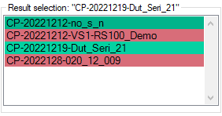
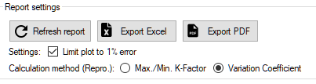
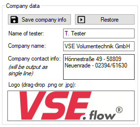

# Kalibrierung {id="calibration"}

## :material-scale-unbalanced:  Kalibrierungsverfahren

### Vorab-Prüfungen 

Sobald die Schaltfläche `Kalibrierungsvorgang starten` gedrückt wird, werden alle konfigurierten Werte auf ihre Gültigkeit überprüft. Einige der geprüften Kriterien sind in der folgenden Liste aufgeführt. Nach erfolgreicher Prüfung werden sie in das Cal.flow Gerät übertragen und der Kalibriervorgang beginnt.

- [x] Name des Kalibrierprotokolls nicht leer
- [x] Probandenname nicht leer
- [x] Master-Linearisierungstabelle gültig und nicht leer
- [x] Viskositäts- und Temperaturfelder nicht leer
- [x] Kalibrierpunkttabelle gültig und nicht leer
- [x] Anzahl der Zyklen ist nicht Null
- [x] Ausgabeverzeichnis ist angegeben, existiert und ist beschreibbar
- [x] Protokoll mit gleichem Namen ist nicht bereits vorhanden

### Beschreibung der Kalibrierprozedur

Nach dem Start der Kalibrierungsprozedur muss die Testperson die Durchflussrate des Prüfstands manuell steuern. Der aktuell angeforderte Wert wird zusammen mit der Durchflußhysterese im Feld `Ziel-Durchflußrate` angezeigt. Die Hysterese- und Stetigkeitsprüfungen laufen kontinuierlich im Hintergrund, um die Messung automatisch auszulösen. Nach einer erfolgreichen Messung wird der gemessene K-Faktor zur Ergebnistabelle hinzugefügt und der nächste Durchflusswert angefordert. Dieser Zyklus wiederholt sich, bis alle Kalibrierpunkte für alle Kalibrierzyklen gemessen sind. Danach kann das Protokoll erstellt werden.

!!! Info "Abbruch der Kalibrierung"
    Der Kalibrierungsprozess kann jederzeit über die Schaltfläche `Kalibrierung abbrechen` abgebrochen werden.

### Durchfluss-Hystereseprüfung

Damit eine Messung ausgelöst werden kann, muss der Durchfluss des Volumensensors innerhalb des angegebenen Durchflussfensters liegen. Das absolute Durchflussfenster wird zusammen mit dem angeforderten Durchflusswert und im Live-Diagramm mit dünnen roten Linien angezeigt. Das Hysterese-Fenster kann entweder durch einen prozentualen Betrag (Feld `Durchflussstetige Hysterese`) oder durch absolute Hysterese-Grenzwerte (Felder `Minimum/Maximum-Durchflusshysterese`) oder durch eine Kombination aus beidem definiert werden. 
Der durchflussabhängige Hysteresewert $H$ wird wie folgt berechnet:

$$
H=\frac{Q_{target}\cdot H_{percent}}{100}
$$

Wenn die `minimale Durchflusshysterese` $H_{min} \neq 0$, wird der berechnete Wert für $H$ auf $H_{min}$ begrenzt, wenn $H<H_{min}$. Wenn die `maximale Durchflusshysterese` $H_{max} \neq 0$, wird der berechnete Wert für $H$ auf $H_{max}$ begrenzt, wenn $H>H_{max}$. 

!!! Tipp
    Diese Funktion ist nützlich, wenn z.B. die Pumpenpulsation bei niedrigen Flussraten zu hoch ist als die gewünschte Hysterese für die restlichen Kalibrierpunkte.

Die Testperson kann die `Anpassungspfeil-Anzeige`, das Live-Diagramm oder die Textfelder `Aktueller Durchfluss` und `Ziel-Durchfluss` als Referenz verwenden, um den Durchfluss korrekt einzustellen.

### Stetigkeitsprüfung

Liegt der tatsächliche Durchfluss des Masters innerhalb des Durchfluss-Hysteresefensters des angeforderten Wertes, so wird für die angegebene Dauer (Feld `Stetige Durchflusszeit`) eine Stetigkeitsprüfung durchgeführt. Während dieser Zeit darf die Durchflussrate das Hysteresefenster nicht überschreiten, andernfalls wird der Steadyness-Zähler zurückgesetzt. 


!!! question "Warum startet die Messung nicht, obwohl der Durchfluss richtig eingestellt ist?"
    Versuchen Sie, die `minimale Durchflusshysterese` höher oder die `Flow steady time` niedriger einzustellen, so dass die Stetigkeitsprüfung erfolgreich abgeschlossen werden kann. Beobachten Sie das Diagramm - liegt der Hauptdurchfluss innerhalb der Hystereselinien?

    Ein weiterer Grund könnte sein, dass die Kalibrierungszustandsmaschine nicht läuft: Der Kalibrierungsprozess muss **immer** über die Schaltfläche ``Kalibrierungsvorgang starten`` auf der Seite ``Kalibrierungseinrichtung`` gestartet werden.

!!! info "Hysterese- und Stetigkeitsprüfung außer Kraft setzen"
    Wenn die Messung aufgrund von unerwartetem Strömungsverhalten oder falsch konfigurierten Einstellungen immer noch nicht auslöst, können die Überprüfungen durch Anklicken des Buttons `Jetzt messen!` übergangen werden, um die Punktaufnahme sofort auszulösen.

    
### Berechnung der aktuellen Impulszahl

Die gewünschte Impulszahl kann über das Feld `Zahl der Zähne/Impulse` eingestellt werden. Die tatsächliche Soll-Impulszahl wird auf der Grundlage des Volumensensors IPF, der Anschlusskonfiguration und der angegebenen `Maximalpunktzeit` berechnet. Unabhängig vom konfigurierten Interpolationsfaktor des Volumensensors verwendet die Software immer dieselbe Anzahl von Volumensensorumdrehungen als Eingangswert. Anhand der Frequenz des Volumensensors beim Start der Messung wird die erwartete Anzahl von Impulsen in der angegebenen maximalen Punktzeit berechnet. Wenn der Parameter `maximale Punktdauer` $\neq 0$ ist und die erwartete Anzahl von Impulsen diese Zeitspanne überschreitet, wird die Zielimpulszahl beschnitten, um unter der angegebenen Zeitgrenze zu bleiben. 

!!!Warnung
    Die Verwendung der Funktion `Maximalzeitpunkt` führt zu einer geringeren und nicht konstanten Messgenauigkeit, wenn die Zielimpulszahl intern abgeschnitten wird. 


### Erfassung und Berechnung des K-Faktors

Nach erfolgreicher Stabilitätsprüfung beginnt die Software mit der Zählung der Impulse beider Volumensensoren und führt eine K-Faktor-Berechnung durch.

#### Messprinzip

Das Messprinzip basiert auf der Ratio-Counting-Methode, um eine hohe Messgenauigkeit zu erreichen. Dieses Prinzip ist eine Frequenzmessmethode, die die Flankenübergänge der Ausgangssignale der Volumensensoren zusammen mit einem hochfrequenten Referenztakt nutzt. Wird der Messstart ausgelöst, werden beide Volumensensoren gleichzeitig gemessen. Zunächst wird die Richtung des Volumensensors überprüft, um die interne Zählrichtung festzulegen. Danach wartet der Cal.flow 250 ms und auf die nächste steigende Signalflanke, um die Zählung tatsächlich zu starten. Es werden sowohl die Impulse des Volumensensors als auch die internen Timer-Takte gezählt, bis die gewünschte Anzahl von Master-Impulsen erreicht ist. Genau während des Flankenübergangs des letzten Masterimpulses wird dessen Impulszählwert abgefragt. Nun wird ein Signal an den Prüflingskanal gesendet, um den Messstopp beim nächsten Flankenwechsel des Prüflings auszulösen. Der Status wird durch Fortschrittsbalken angezeigt. 




!!! Warnung "Zählungen sind nicht vergleichbar"
    Nach Beendigung der Messung erhalten Sie einen Ergebniseintrag, der auch die Impulszahlen von Master und Slave enthält. Diese Werte entsprechen zwar den tatsächlich gemessenen Impulsen, können aber nicht miteinander verglichen werden, da die Master- und DUT-Kanäle nicht die gleiche Zeitbasis (exakte Messzeit) haben. Um die beiden Volumensensoren genau zu vergleichen, verwenden Sie die Frequenzwerte oder die Formel in der nächsten Hilfeblase.

!!! question "Virtuelle DUT-Impulszahl berechnen"
    Sie können auch eine exakte Prüflingsimpulszahl berechnen, um sie mit der Master-Impulszahl zu vergleichen, indem Sie die folgende Formel verwenden: 

    $$
    \frac{n_{\text{DUT}}}{n_{\text{Master}}} = \frac{f_{\text{DUT}}}{f_{\text{Master}}} \Leftrightarrow n_{\text{DUT}} = \frac{f_{\text{DUT}}\cdot n_{\text{Master}}}{f_{\text{Master}}} \Rightarrow n_{\text{DUT}} = \frac{f_{\text{DUT}}\cdot 10000}{f_{\text{Master}}}
    $$


#### Berechnung des K-Faktors

Der K-Faktor des Prüflings wird auf der Grundlage der durchschnittlichen Frequenzen beider Volumensensoren im Messintervall berechnet. Die Durchflussmenge durch beide Volumensensoren wird als gleich angesehen, was zu den folgenden Gleichungen führt. Da die genauen Kalibrierwerte des Volumensensors bekannt sind, kann der K-Faktor des Prüflings direkt mit nur drei Werten berechnet werden. 

!!! info inline end "Hängt von der Anschlusskonfiguration ab" 

    Wenn die Portkonfiguration auf 2-kanalige Auswertung eingestellt ist, werden alle Signalflanken gezählt. Dies hat zur Folge, dass die gemessene Frequenz durch $4$ geteilt wird. Bei einkanaliger Auswertung kann der Faktor weggelassen werden, da nur steigende Flanken gezählt werden.

$$
f_{M} = (\frac{1}{4}) \cdot \frac{f_{CLK} \cdot n_{Impulse,M}}{n_{CLK,M}}
$$

$$
f_{DUT} = (\frac{1}{4}) \cdot \frac{f_{CLK} \cdot n_{pulses,DUT}}{n_{CLK,DUT}}
$$

$$
K_{Fact,DUT}=\frac{K_{Fact,M}(f_{M})\cdot f_{DUT}}{f_{M}}
$$

!!! info "Berechnung des K-Faktors des Masters" 

    Die Berechnung des Master-K-Faktors $K_{Fact,M}(f_{M})$ erfolgt durch lineare Interpolation der mitgelieferten Master-Linearisierungstabelle. Die Funktion verwendet die gemessene Frequenz als Eingabe für die Berechnung des passenden K-Faktors. Der lineare Interpolationsalgorithmus verwendet die $f/K_{Fact}$-Kurve des Volumensensors, um die Berechnungen durchzuführen.

### Ergebnisliste

Nach jedem abgeschlossenen Messpunkt werden die Messergebnisse von cal.flow an den PC übertragen und in der untenstehenden Ergebnistabelle angezeigt:


**Spalte** | **Beschreibung**
--- | ---
Nr. | Messstellenindex, der sich auf die [hier](program.md#step-5-measurement-configuration) definierten Messstellen bezieht
Zyklus | Index des Messzyklus, der angibt, wie oft dieser Punkt bereits gemessen wurde
Flowrate | Durchflusswert in Litern pro Minute (linearisierter Wert vom Master)
K-Faktor | Resultierender Kalibrierungsfaktor für den Prüfling an diesem spezifischen Punkt. Die Einheit ist Pulse pro Liter
Freq. DUT | Genauer Frequenzwert, der auf dem DUT-Kanal gemessen wurde
Freq. Master | Genauer Frequenzwert, der auf dem Masterkanal gemessen wurde 
Meas. pulses DUT | Tatsächliche Anzahl der gemessenen Prüflingsimpulse 
Theor. pulses DUT | Theoretische Anzahl von Impulsen basierend auf den genau gemessenen Frequenzen und der Master-Zählung. Dieser Wert ist besser, wenn Sie ihn mit der Master-Impulszahl vergleichen wollen. 
Meas. pulses Master | Tatsächliche Anzahl der Master-Impulse, die gemessen wurden  

## :material-file-chart:  Kalibrierungsbericht

Ein Kalibrierungsbericht enthält alle Informationen über die Kalibrierung und dokumentiert die gesamte Messung. Er enthält Daten wie:

* Referenzsensor
* Prüfsensor (DUT)
* Volumensensor-Einstellungen
* Messbedingungen
* Informationen zum Unternehmen und zur Testperson
* Datum und Uhrzeit
* Zusätzliche Informationen

### Ergebnisselektor



Sie kann entweder nach einer abgeschlossenen Kalibrierung aus dieser Programmsitzung generiert oder über das [file menu](basics.md#file-menu) importiert werden. In beiden Fällen werden die Kalibrierungsdaten im Ergebnisselektor angezeigt (siehe Bild). Der Eintrag ist grün hinterlegt, wenn die Kalibrierung erfolgreich abgeschlossen wurde. Eine rote Farbe zeigt an, dass die Kalibrierungsdaten unvollständig sind und nicht für die Berichterstellung verwendet werden können.

Wenn ein Ergebnis ausgewählt ist, wird das zugehörige Kalibrierungsprotokoll im Vorschaufenster erstellt. 

### Plot-Einstellungen



__Berichtfehlerplot auf ±1% begrenzen__ 

:material-checkbox-outline: Wenn diese Option aktiviert ist (_Standard_), beträgt der Fehlerplotbereich des generierten Kalibrierungsprotokolls ±1%. 

:material-checkbox-blank-outline: Wenn nicht angekreuzt, wird die Skalierung automatisch berechnet.

__Wiederholbarkeitsberechnungsmethoden__ 

Wählen Sie zwischen zwei Berechnungsmodi für die Wiederholbarkeit der Messstelle. Die Wiederholbarkeit gibt an, wie wiederholbar ein gemessener Durchflusswert unter gleichen Durchflussbedingungen zu verschiedenen Zeiten (z.B. Messzyklen) ist. Eine Wiederholbarkeitsberechnung ist nur bei mindestens zwei Zyklen möglich.

1. Die erste Methode basiert auf dem maximalen, minimalen und durchschnittlichen K-Faktor aller gemessenen Zyklen eines Punktes und wird wie folgt berechnet:

    $$
    \textrm{Wiederholbarkeit im Punkt n [%]} = \frac{(K_{\textrm{n,max}} - K_{\textrm{n,min}})}{\overline{K_{\textrm{n}}}} \cdot \frac{100}{2}
    $$

2. Der andere basiert auf dem Variationskoeffizienten, der aus dem Durchschnitt und der Standardabweichung aller gemessenen Zyklen eines Punktes wie folgt berechnet wird:

    $$
    \textrm{Wiederholbarkeit im Punkt n [%]} = 100 \cdot \frac{\sigma_{\text{ K,n}}}{\overline{K_{n}}}
    $$

<!-- Manuell gesetzter Sprungpunkt -->
<a id="error-calc"></a>

__Fehlerberechnung__

Der relative Fehler im Punkt \(n\) [%] wird auf Basis des arithmetischen Mittelwerts $\overline{K}$ aller gemessenen K-Faktoren berechnet als:

$$
\mathrm{Relativer\ Fehler}_n\ [\%] = 100 \cdot \frac{K_n - \overline{K}}{\overline{K}}
$$

### Verwaltung der Unternehmensdaten


Um das im Kalibrierprotokoll angezeigte Firmenlogo, den Namen und die Adresse zu ändern (_Firmenadresse siehe Seitenfuß_), geben Sie die Daten in die vorgesehenen Eingabefelder ein. Um das Logo zu setzen oder zu überschreiben, suchen Sie Ihr Logo als `*.jpg` oder `*.png` mit dem Explorer und ziehen es in das Logofeld. Die Daten können dann über die Schaltfläche `Firmeninfo speichern` dauerhaft gespeichert werden. Die Daten werden beim Programmstart automatisch wiederhergestellt.

Nach einer Änderung der Firmendaten ist eine manuelle Aktualisierung des generierten Kalibrierprotokolls erforderlich. Bitte verwenden Sie dazu die Schaltfläche `Protokoll aktualisieren` oberhalb der Protokollvorschau.

### Exportoptionen

Nach Abschluss einer Kalibrierung und der Erstellung eines Protokolls gibt es mehrere Möglichkeiten, die Ergebnisse zu speichern und zu exportieren. Generell wird die Ergebnisdatei während und nach der Kalibrierung automatisch im angegebenen Ausgabeverzeichnis gespeichert. 

**1. Verwendung der Speicheroptionen**


**Option** | **Beschreibung**
--- | ---
Ausgabeverzeichnis öffnen | Schnellverknüpfung zum Öffnen des Stammverzeichnisses des angegebenen Ausgabeverzeichnisses. Die Ergebnisdateien befinden sich in einem Ordner, der aus dem aktuellen Jahr und Monat ```YYYY-MM`` besteht.
PDF-Protokoll speichern | Speichert das angezeigte Kalibrierungsprotokoll direkt in eine PDF-Datei an einem vom Benutzer festgelegten Ort.
Ergebnisdatei speichern | Speichert eine Kopie des aktuell geladenen Ergebnisses an einem benutzerdefinierten Ort.
Kalibrierung speichern *.zip | Exportiert ein Archiv mit allen möglichen Daten über die Kalibrierung. Es enthält die Ergebnisdatei, das Bericht-PDF und alle aktuell ausgewählten Vorlagen. Diese Option ist nur direkt nach Abschluss einer Kalibrierung sinnvoll, da alle Vorlagen und Einstellungen noch ausgewählt sind. Nur die derzeit aktiven Vorlagen werden in die *.zip-Datei exportiert. Verwenden Sie diese Option, um Vorlagen und Ergebnisdaten an andere Instanzen von VSE EasyCal zu senden/zu übertragen.

**2. Verwendung der Exportoptionen des Reportviewers**


Innerhalb des Berichtsfensters gibt es Optionen, um den angezeigten Bericht als PDF-, Word- oder Excel-Datei zu exportieren.

**3. Export von Berichtsdaten in externe Programme**


Über die Schaltflächen am oberen Rand des Berichtsviewers können die Daten in andere Programme exportiert werden. Der `Export PDF` öffnet den Bericht direkt im Standard-PDF-Viewer zur weiteren Bearbeitung. Um die Kalibrierungsergebnisse mit höherer Genauigkeit als auf dem generierten Bericht zu prüfen und weitere Berechnungen zu ermöglichen, können die Ergebnisse mit dem Button `Export Excel` in eine Excel-Tabelle mit allen verfügbaren Stellen exportiert werden. 

!!! Warnung "Excel-Export $\neq$ Excel-Export"
    Die Excel-Exportfunktion der Berichtsansicht (in Option 2) **führt** nicht zum gleichen Ergebnis wie der Excel-Export über den separaten Button in Option 3. Während bei der ersten Option nur das Layout des Berichtsgenerators in Zellen exportiert wird, exportiert die zweite Option die in der Kalibrierungs-Registerkarte angezeigten Tabellen mit der maximalen Anzahl von Stellen für weitere Berechnungen.

