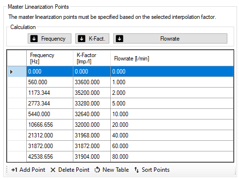
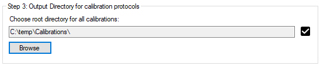

# Einrichtung der Kalibrierung

### Navigation

Das Setup ist wie ein Schritt-für-Schritt-Assistent aufgebaut, der Sie durch das Kalibrierungs- und Dokumentationsverfahren führt. 
Verwenden Sie die Schaltflächen am oberen Rand, um zwischen den Seiten zu navigieren. Die Software wird Sie darauf hinweisen, wenn Sie etwas übersehen haben.


### :material-crown:  Master-Einstellungen {id="master-setup"}
Auf der Master-Setup-Seite werden alle Einstellungen, die den Volumensensor betreffen, wie Linearisierungsdaten und IPF, vorgenommen. 
Außerdem wird die Spannungsversorgung überprüft und ein Speicherpfad angegeben, in dem die Ergebnisdateien automatisch gespeichert werden.  
#### Schritt 1: Master-Kalibrierungsdaten laden {id="step-1-load-master-calibration-data"}


Der Typ und die Seriennummer des Volumensensors werden zu Dokumentationszwecken abgefragt, da sie auf dem generierten Kalibrierungsprotokoll angegeben sind. Die IPF wird für die Berechnung der gemessenen Impulse verwendet und sollte mit den Frequenzen und K-Faktoren der entsprechenden Linearisierungstabelle übereinstimmen. 

Mit der Portkonfiguration wird das Messprinzip des Cal.flow konfiguriert. Für die meisten Volumensensoren können Sie die zweikanalige Auswertung (_Standard_) verwenden. Bei bestimmten einkanaligen Volumensensoren (EF/VHM) müssen Sie den Eingangspin angeben. Bitte lesen Sie auch die [Hinweise zu PNP/NPN-Signalen](basics.md#m12-input-signals) für diese Volumensensor-Ausgangstypen.

**Linearisierungstabelle**



Die Linearisierungstabelle kann manuell eingegeben oder aus einer Microsoft Word- oder Excel-basierten Tabelle in einem passenden Format kopiert werden. Der Befehl `Einfügen` fügt die Tabelle ab der zuletzt markierten Zelle ein, also klicken Sie bitte mit der linken Maustaste auf die Zelle oben links, wo das Einfügen beginnen soll. Verwenden Sie nach dem Einfügen die Schaltfläche `Punkte sortieren`, um die Punkte unten auszurichten.
Die Frequenzen und der K-Faktor sollten mit dem Interpolationsfaktor des Volumensensors übereinstimmen.

!!! info "Linearisierung ist mit im Master-Preset"

    Die Linearisierungstabelle wird zusammen mit dem Master-Preset gespeichert, auch wenn sie sich nicht in der gleichen Groupbox befindet.

!!! info "Zeit sparen bei der Linearisierungstabelle"

    Bitte beachten Sie, dass nur zwei Spalten in die Linearisierungstabelle eingetragen werden müssen. Die dritte Spalte kann aus den beiden anderen berechnet werden, indem Sie auf die entsprechende Berechnungsschaltfläche klicken (siehe Abbildung).


#### Schritt 2: Spannungsversorgung für Volumensensoren


Für die Stromversorgung kann der Benutzer zwischen 3 Optionen wählen:

- **Option 1:** Verwendung eines M12 T-Steckers zur Einspeisung von 24V in eines der Kabel des Volumensensors. Die Stromversorgung wird dann mit dem anderen Volumensensor gebrückt. Bei dieser Option wird keine Spannungsprüfung durch den Cal.flow durchgeführt.

- **Option 2:** Verwendung einer externen 24-V-Stromversorgung und Anschluss an den DC-Stromversorgungsbuchseneingang. Der Verbindungsstatus des Steckers wird in der Statusbox angezeigt. Bitte nicht zusammen mit T-Stücken verwenden!

!!! warning inline end "Achtung bei 2 Testboxen" 

    Die Leistungsaufnahme von zwei VSE TestBox 2 Geräten ist zu groß, um sie mit dem internen Boost-Converter zu betreiben. Verwenden Sie die externe Stromversorgung!

- **Option 3:** Verwendung des internen 5V zu 24V Boost-Konverters. Er kann über die entsprechende Schaltfläche neben dem Statusfeld umgeschaltet werden. Es muss keine zusätzliche Spannungsversorgung angeschlossen werden. Die Stromversorgung des Volumensensors erfolgt über den USB-Anschluss des PCs. Um eine Überhitzung und Beschädigung des Cal.flow zu vermeiden, ist eine maximale kombinierte Stromaufnahme von 50mA @ 24V beider Volumensensoren erlaubt. Wenn der interne Boost-Converter aktiv ist, während die DC-Buchse eingesteckt ist, wird der Boost-Converter automatisch abgeschaltet.

!!! danger "Warnung: Ext. Netzteil nicht bei Anlagenspannung verwenden"
    Vor Anschluss und Verwendung des externen Netzteils sollte, insbesondere bei Verwendung von T-Stücken, sichergestellt werden, dass das Netzteil nicht Spannung in die Anlage zurückspeist bzw. mit dem 24V-Rail der Anlage verbunden wird. Andernfalls wird bei Spannungsabschaltung der Anlage diese über das Netzteil versorgt und dieses überhitzt oder kann sogar zerstört werden. 


#### :material-test-tube: Schritt 3: Flüssigkeitsspezifikation


Die Kalibrierungsviskosität und die Temperatur der Flüssigkeit müssen angegeben werden, da sie auch auf dem Kalibrierungsprotokoll erscheinen. Diese Werte können auch als separate Voreinstellung gespeichert werden, um sie bei anderen Kalibrierungen zu verwenden. 

#### Schritt 4: DUT-Einrichtung


Auf der Registerkarte `DUT setup` wird der Volumensensor für den Test festgelegt. Dieser Schritt ist vergleichbar mit [Schritt 1](program.md#step-1-load-master-calibration-data) - aber diesmal müssen die Prüflingsdaten angegeben werden. Auch hier werden Volumensensortyp und Seriennummer zur Dokumentation des Kalibrierprotokolls abgefragt. Der ungefähre oder nominale K-Faktor (einschließlich IPF) wird verwendet, um die Durchflussrate aus der gemessenen Frequenz zu berechnen, so dass der richtige Wert im Live-Plot angezeigt wird. Bei VSE Volumensensoren kann der K-Faktor über die Schaltfläche `Look up` nachgeschlagen werden. Alternativ kann der ungefähre Wert auch mit der Taste `Messen` gemessen werden, wobei ein gleichmäßiger Durchfluss durch beide Volumensensoren erfolgt. Die Durchflussrate wird dann mit den aktuellen Frequenzwerten beider Volumensensoren berechnet. Schauen Sie sich die Live-Darstellung an, um zu überprüfen, ob die gewählte Konfiguration des Eingangsanschlusses für den Prüfling korrekt ist.


#### Schritt 5: Konfiguration der Messung {id="step-5-measurement-configuration"}


##### Beschreibung der Kalibrierungsprozedur
Bei der Kalibrierungsprozedur wird der Prüfer aufgefordert, die Durchflussrate manuell auf jeden der angegebenen [Kalibrierungspunkte](program.md#calibration-point-setup) einzustellen. Wenn der tatsächliche Durchfluss des Masters innerhalb des Durchfluss-Hysteresefensters des angeforderten Wertes liegt, wird für eine bestimmte Dauer eine Stabilitätsprüfung durchgeführt. Während dieser Zeit darf der Durchfluss das Hysteresefenster nicht überschreiten, andernfalls wird der Stetigkeitszähler zurückgesetzt. Nach erfolgreicher Gleichmäßigkeitsprüfung beginnt die Software mit der Zählung der Impulse beider Volumensensoren und führt eine K-Faktor-Berechnung durch. Die Software fordert dann den Benutzer auf, den Durchfluss für den nächsten Kalibrierungspunkt einzustellen. Dieser Zyklus wiederholt sich, bis alle Kalibrierpunkte für alle Kalibrierzyklen gemessen sind. Danach kann das Protokoll erstellt werden.

##### Impulszählung und Kalibrierung einrichten
Die folgenden Parameter können konfiguriert werden:

**Parameter** | **Beschreibung**
--- | ---
Anzahl der Zyklen | Anzahl, wie oft die Messung aller Kalibrierpunkte wiederholt wird. Für die Berechnung der Reproduzierbarkeit ist ein Mindestwert von `2` erforderlich.
Anzahl der Verzahnungen/Impulse | Anzahl der gemessenen Verzahnungen/Impulse (≙ nicht interpolierte steigende Signalflanken eines Kanals). Je höher der Wert ist, desto genauer sind die Ergebnisse. Bitte beachten Sie, dass die Messzeit für jeden Punkt ebenfalls ansteigt. Die Gesamtzahl der gemessenen Signalflanken wird intern auf der Grundlage des IPF und der Portkonfiguration jedes Kanals berechnet.
Resultierendes Flüssigkeitsvolumen | Informativer Wert, der das Volumen angibt, das der Zielimpulszahl entspricht.
Zeitlimit | Die maximale Punktkalibrierungszeit kann durch diesen Wert begrenzt werden (Einheit: Sekunden). Die Gesamtzahl der Signalflanken wird dann so beschnitten, dass sie in den angegebenen Zeitrahmen passen. Verwenden Sie diese Funktion, wenn die Messzeit bei niedrigen Durchflussraten sehr lang ist. Die Verwendung dieser Funktion kann die Genauigkeit des berechneten K-Faktors verringern. Wenn Sie den Wert auf Null setzen, wird die Zeitbegrenzung deaktiviert. Dadurch wird das Abschneiden der Gesamtzahl der Signalflanken verhindert und eine konstante Messgenauigkeit erzielt.

##### Erweiterte Messeinstellungen 

**Parameter** | **Beschreibung**
--- | ---
Minimale Messzeit | Gegenstück zu `Zeitlimit`: Besonders wenn hohe Frequenzen gemessen werden, stellt ein Wert `>0` sicher, dass mindestens die angegebene Dauer gemessen wird. Setzen Sie diesen Wert auf `0`, um diese Funktion zu deaktivieren.
Durchflussstabilitätszeit | Stetigkeitsprüfung: Der Durchfluss muss für diese Dauer konstant sein, um die Messung zu starten (Einheit: Sekunden).
Durchflussstabilitätshysterese | Stetigkeitsprüfung: Der Durchfluss muss in diesem Durchflussbereich konstant sein, um die Messung zu starten (Einheit: % von Q).
Minimale Durchflusshysterese | Stetigkeitsprüfung: Begrenzen Sie die minimale Hysterese, die aus dem Prozentsatz der `Stetigen Durchflusshysterese` berechnet wird. Dies ist nützlich, wenn der Durchfluss pulsiert oder nicht mit ausreichender Präzision eingestellt werden kann. Diese Funktion kann durch Eingabe von `0` deaktiviert werden. Dieser Wert sollte sich danach richten, wie genau Sie die Durchflussrate Ihres Kalibriersystems bei niedrigen Durchflussraten einstellen können.
Maximale Durchfluss-Hysterese | Steadyness-Check: Begrenzen Sie die maximale Hysterese, die aus dem Prozentsatz der `Stetigen Durchflusshysterese` berechnet wird. Dies ist nützlich, wenn Sie auch im höheren Durchflussbereich exakte Kalibrierpunkte setzen wollen. Diese Funktion kann durch Eingabe von `0` deaktiviert werden. Dieser Wert sollte sich danach richten, wie genau Sie die Durchflussrate Ihres Kalibriersystems bei hohen Durchflussraten einstellen können.

#### Schritt 6: Einrichtung der Kalibrierungspunkte {id="calibration-point-setup"}


Die Kalibrierpunkte sind die Durchflussraten, die im Kalibrierverfahren geprüft werden. Mindestens ein Punkt muss angegeben werden. Die Werte können entweder manuell über die vier Schaltflächen am unteren Rand der Tabelle eingegeben oder automatisch mit Hilfe des [Template Generators](program.md#template-generator) berechnet werden. 

##### Template-Generator 


Der Vorlagengenerator ermöglicht es dem Benutzer, eine bestimmte Anzahl von Kalibrierpunkten in einem benutzerdefinierten Bereich von Durchflussraten zu berechnen. Wenn ein VSE Volumensensor kalibriert werden soll, können die Minimal- und Maximalwerte der Durchflussrate zum Ausfüllen der Eingabefelder herangezogen werden. Danach können die Werte manuell an den gewünschten Durchflussbereich angepasst werden. Es gibt drei Berechnungsarten für die Verteilung der Kalibrierungspunkte:

**Berechnungsstil** | **Erläuterung**
--- | ---
Linear | Gleichmäßige Verteilung der Kalibrierpunkte im angegebenen Intervall
Exponential | Verwendung einer Exponentialfunktion zur Verteilung der Kalibrierpunkte. Dadurch werden mehr Punkte in den unteren Durchflussbereich verschoben, wo die Genauigkeit des Volumensensors nicht linear ist und mehr Punkte benötigt werden, um seine Kennlinie zu beschreiben.
Exponential^2 | Wendet die Exponentialfunktion ein zweites Mal an, um die Punkte noch stärker in den unteren Bereich umzuverteilen.

#### Schritt 7: Ausgabeverzeichnis für Kalibrierungsprotokolle


In diesem Schritt muss das Verzeichnis für die Speicherung aller Kalibrierungsergebnisse angegeben werden. Der Ordnerpfad wird automatisch für alle folgenden Programmstarts gespeichert. Das Verzeichnis, das angegeben wird, ist das Stammverzeichnis der folgenden Verzeichnisstruktur:

```
├── Stammverzeichnis
│ ├── YYYY-MM (Verzeichnis für Jahr und Monat)
│ │ ├── CP-*.xml (Kalibrierdaten-Datei)
```

#### Schritt 8: Festlegen der Dokumentationseinstellungen


In diesem Schritt muss der Protokollname angegeben werden. Wenn der Name nicht wichtig ist, kann er automatisch aus der Seriennummer des Prüflings und dem aktuellen Datum generiert werden. Wird kein Name eingegeben und die Kalibrierung gestartet, fordert das Programm erneut auf, automatisch einen Namen zu generieren. 

Außerdem wird der Name des Probanden abgefragt, da er auf das Kalibrierprotokoll geschrieben wird. Eine Liste der letzten Namen wird in der Autovervollständigungshistorie des Feldes gespeichert. 

Das Feld "Zusatzinfo" ermöglicht es dem Prüfer, die Messung näher zu spezifizieren. Der Text wird auch auf dem Kalibrierungsprotokoll angezeigt. 

!!! Tipp 

    Der Name der Testperson und der Inhalt des Feldes 'Zusatzinfo' können auch später bei der Protokollerstellung geändert werden.


#### Starten der Messung

Um die Messung zu starten, betätigen Sie die Schaltfläche ``Weiterer Schritt``. Die Software prüft zuvor alle eingegebenen Werte auf ihre Gültigkeit. Falls eine Meldung angezeigt wird, folgen Sie den Hinweisen, um das Problem zu lösen, bevor Sie fortfahren.

[:material-arrow-right: Gehe zum nächsten Kapitel](procedure.md#calibration)


