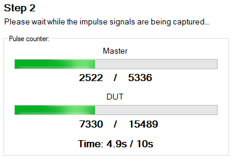
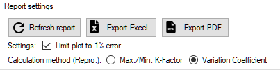
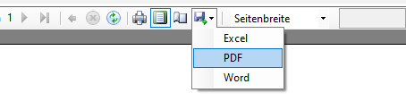

# Calibration

## :material-scale-unbalanced:  Calibration Procedure

### Pre-checks

Once the ```Start calibration procedure``` button is pressed, all configured values will be checked for validess. Some of the checked criteria are shown in the following list. After a successful check, they are transmitted into the Cal.flow device and the calibration procedure begins.

- [x] Calibration protocol name not empty
- [x] Test person name not empty
- [x] Master linearization table valid and not empty
- [x] Viscosity and temperature fields not empty
- [x] Calibration point table valid and not empty
- [x] Number of cycles is not zero
- [x] Output directory is specified, exists and is writable
- [x] Protocol with same name is not already existing

### Description of the calibration procedure

After starting the calibration procedure, the test person needs to manually control the flowrate of the test bench. The currently requested value is shown along with the flow hysteresis in the ```target flowrate``` field. The hysteresis and steadyness checks are running continuously in the background to automatically trigger the measurement. After a successful measurement, the measured K-Factor is added to the result table and the next flowrate value will be requested. This cycle repeats until all calibration points for all calibration cycles are measured. After this, the protocol can be generated.

!!! info "Aborting the calibration"
    The calibration process can always be aborted using the ```Abort calibration``` button.

### Flowrate hysteresis check

For a measurement to be triggered, the flowrate of the master flowmeter must be within the specified flowrate window. The absolute flowrate window will be shown together with the requested flow value and in the live graph using thin red lines. The hysteresis window can be defined using either a percent amount (```flow steady hysteresis``` field) or absolute hysteresis limits (```minimum/maximum flow hysteresis``` fields) or a combination of both. 
The flow-dependent hysteresis value $H$ is calculated as follows:

$$
H=\frac{Q_{target}\cdot H_{percent}}{100}
$$

If the ```minimum flow hysteresis``` $H_{min} \neq 0$, the calculated value for $H$ will be limited to $H_{min}$, if $H<H_{min}$. If the ```maximum flow hysteresis``` $H_{max} \neq 0$, the calculated value for $H$ will be limited to $H_{max}$, if $H>H_{max}$. 

!!! tip
    This feature is useful if e.g. the pump pulsation is to high in with low flowrates than the desired hysteresis for the rest of the calibration points.

The test person can use the ```Adjust arrow indicator```, the live graph or the ```current flowrate``` and ```target flowrate``` text fields for reference to adjust the flow correctly.

### Steadyness check

If the actual flowrate of the master is inside the flowrate hysteresis window of the requested value, a steadyness check will be performed for the specified duration (```flow steady time``` field). During this time, the flowrate must not exceed the hysteresis window, otherwise the steadyness counter will be reset. 


??? question "Why does the measurement not start even though the flow is set correctly?"
    Try to set the ```minimum flow hysteresis``` higher or ```flow steady time``` lower so that the steadyness check can complete successfully. Watch the graph - is the master flowrate inside the hysteresis lines?
    
    Another reason could be that the calibration state machine is not running: The calibration process must **always** be started using the ```Start calibration procedure``` button on the ```calibration setup``` page.

!!! info "Overriding the hysteresis and steadyness check"
    If the measurement still does not trigger due to unexpected flow behaviour or incorrectly configured settings, the checks can be overridden by clicking on the ```Measure now!``` button to instantly trigger the point aquisition.

    
### Calculation of the actual pulse count

The requested pulse count can be set using the ```number of gear teeth/pulses``` field. The actual target count is calculated based on the flowmeters IPF, the port configuration and the specified ```maximum point time```. Indepenently of the configured interpolation factor of the flowmeter, the software will always use the same number of flowmeter rotations as an input value. Using the flowmeter's frequency during the start of the measurement, the expected number of pulses in the specified maximum point duration will be calculated. If the ```maximum point time``` parameter is $\neq 0$ and the expected number of pulses exceed this time span, the target pulse count will be cropped to stay below the specified time limit. 

!!! warning
    Using the ```maximum point time``` function will lead to a lower and non-constant measurement accuracy if the target pulse count gets internally cropped. 


### K-Factor aquisition and calculation

After the steadyness check is successful, the software will start counting the pulses of both flowmeters and perform a K-Factor calculation.

#### Measurement principle

The measurement principle is based on the ratio counting method to achieve a high measurement accuracy. This principle is a frequency measuring method which uses the edge transitions of the flowmeters output signals together with a high-frequency reference clock. When the measurement start is triggered, both flowmeters get measured simultaneously. At first, the direction of the flowmeter is checked to set the internal counting direction. Next, the Cal.flow waits 250 ms and for the next rising signal edge to actually start the counting. Both the flowmeter pulses and the internal timer clocks will be counted until the requested number of master pulses is reached. Exactly during the edge transition of the last master pulse, its pulse count value is retrieved. A signal is now sent to the DUT channel to trigger the measurement stop at the next DUT edge transition. The status will be shown using progress bars. 




!!! warning "Counts are not comparable"
    After finishing the measurement you get a result entry that also contains pulse counts of the master and slave. While these values correspond to the actual measured pulses, they can not be compared, as the master and DUT channels don't share the same timebase (exact measurement time). To exactly compare both flowmeters, use the frequency values or the formula in the next help bubble.

??? question "Calculate virtual DUT pulse count"
    You can also calculate an exact DUT pulse count to compare it to the masters pulse count using the following formula: 

    $$
    \frac{n_{\text{DUT}}}{n_{\text{Master}}} = \frac{f_{\text{DUT}}}{f_{\text{Master}}} \Leftrightarrow n_{\text{DUT}} = \frac{f_{\text{DUT}}\cdot n_{\text{Master}}}{f_{\text{Master}}} \Rightarrow n_{\text{DUT}} = \frac{f_{\text{DUT}}\cdot 10000}{f_{\text{Master}}}
    $$


#### Calculation of the K-Factor

The K-Factor of the DUT is calculated based on the average frequencies of both flowmeters in the measurement interval. The flowrate through both flowmeters is considered equal which leads to the following equations. Because the exact calibration values of the master flowmeter are known, the DUT's K-Factor can be directly calculated using only three values. 

!!! info inline end "Depends on port config" 

    If the port configuration is set to 2-channel evaluation, all signal edges are counted. As a consequence the measured frequency is divided by $4$. For single channel evaluation, the factor can be omitted as only rising edges are counted.

$$
f_{M} = (\frac{1}{4}) \cdot \frac{f_{CLK} \cdot n_{pulses,M}}{n_{CLK,M}}
$$

$$
f_{DUT} = (\frac{1}{4}) \cdot \frac{f_{CLK} \cdot n_{pulses,DUT}}{n_{CLK,DUT}}
$$

$$
K_{Fact,DUT}=\frac{K_{Fact,M}(f_{M})\cdot f_{DUT}}{f_{M}}
$$

!!! info "Calculation of master's K-Factor" 

    The calculation of the master's K-Factor $K_{Fact,M}(f_{M})$ is done using linear interpolation of the supplied master linearization table. The function uses the measured frequency as an input to calculate the matching K-Factor. The linear interpolation algorithm uses the $f/K_{Fact}$ curve of the master flowmeter to perform the calculations.

### Result List

After each completed measurement point, the measurement results are transmitted from cal.flow to the PC and shown in the result table below:


**Column** | **Description**
--- | ---
No. | Measurement point index which refers to the measurement points definied [here](program.md#step-5-measurement-configuration)
Cycle | Measurement cycle index which is a count that shows how many times this pointalready has been measured
Flowrate | Flowrate value in liters per minute (linearized value coming from the master)
K-Factor | Resulting calibration factor for the DUT at this specific point. The unit is pulses per liter
Freq. DUT | Precise frequency value that was measured on the DUT channel
Freq. Master | Precise frequency value that was measured on the Master channel 
Meas. pulses DUT | Actual number of DUT pulses that have been measured 
Theor. pulses DUT | Theoretical number of pulses based on the precisely measured frequencies and the master count. This value is better if you want to compare it to the master's pulse count. 
Meas. pulses Master | Actual number of master pulses that have been measured  

## :material-file-chart:  Calibration Report

A calibration report contains all information about the calibration and documents the whole measurement. It contains data like:

* Reference sensor
* Test sensor (DUT)
* Flowmeter settings
* Measurement conditions
* Company and test person information
* Date and Time
* Additional information

### Result selector


It can be either generated after a finished calibration from this program session or imported using the [file menu](basics.md#file-menu). In both cases, the calibration data will be shown in the result selector (see image). The item will show a green background color, if the calibration was completed successfully. A red color shows that the calibration data is incomplete and cannot be used for report generation.

When a result is selected, it's calibration protocol will be generated in the preview window. 

### Plot settings



__Clamp report error plot to ±1%__ 

:material-checkbox-outline: If checked (_default_), the error plot range of the generated calibration protocol will be ±1%. 

:material-checkbox-blank-outline: If unchecked, the scaling will be calculated automatically.

__Reproducibility calculation methods__ 

Choose between two calculation modes for the measurement point repeatability. The repeatability indicates how repeatable a measured flow value is under the same flow conditions at different times (e.g. measurement cycles). A repeatability calculation is only possible with at least two cycles.

1. The first method is based on the maximum, minimum and average K-Factor of all measured cycles of a point and calculated like so:

    $$
    \textrm{Repeatability at Point n [%]} = \frac{(K_{\textrm{n,max}} - K_{\textrm{n,min}})}{\overline{K_{\textrm{n}}}} \cdot \frac{100}{2}
    $$

2. The other one is based on the variation coefficient which is calculated using the average and standard deviation of all measured cycles of a point like so:

    $$
    \textrm{Repeatability at Point n [%]} = 100 \cdot \frac{\sigma_{\text{ K,n}}}{\overline{K_{n}}}
    $$

### Company data management


To change the company logo, name and address shown in the calibration protocol (_see page footer for company address_), enter the data into the provided input fields. To set or overwrite the logo, find your Logo as a ```*.jpg``` or ```*.png``` file using Explorer and drag it into the logo box. The data can then be saved permanently using the ```Save company info``` button. The data will be automatically restored on program start.

After changing the company data, a manual refresh of the generated calibration protocol is required. Please use the ```Refresh report``` button above the report preview for this purpose.

### Export options

After finishing a calibration and generating a report there are several options to save and export the results. Generally, the result file is automatically saved in the specified output directory during and after calibration. 

**1. Using the Save options**


**Option** | **Description**
--- | ---
Open output directory | Quick shortcut to open the root of the specified output directory. The result files will be inside a folder consisting of the current year and month ```YYYY-MM```.
Save PDF protocol | Directly save the shown calibration protocol to a PDF file at a user specified location.
Save result file | Save a copy of the currently loaded result to a user specified location.
Save calibration *.zip | Export an archive containing all possible data about the calibration. It will contain the result file, the report PDF and all currently selected templates. This option is only useful directly after a calibration is finished as all templates and settings are still selected. Only the currently active templates will be exported into the *.zip file. Use it to send/transfer templates and result data to other instances of VSE EasyCal.

**2. Use of the export options of the report viewer**



Inside the report viewer window, there are options to export the shown report as a PDF, Word or Excel file.

**3. Export of report data to external programs**


Using the buttons on top of the report viewer, the data can be exported into other programs. The ```Export PDF``` will directly open the report in the standard PDF viewer for further editing. To inspect the calibration results with higher precision than on the generated report and allow for futher calculations, the results can be exported into a Excel sheet with all available digits using the button ```Export Excel```. 

!!! warning "Excel export $\neq$ Excel export"
    The excel export function of the report view (in option 2) **does not** lead the same result as the excel export using the seperate button in option 3. While the first option exports only the report generator's layout in cells, the second option exports the tables displayed in the calibration tab with the maximum number of digits for further calculations.


