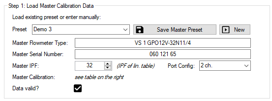
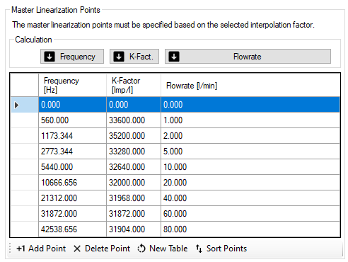
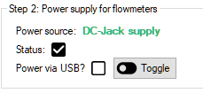
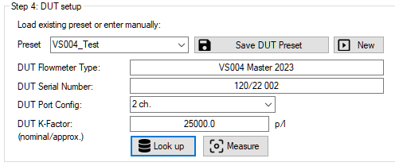
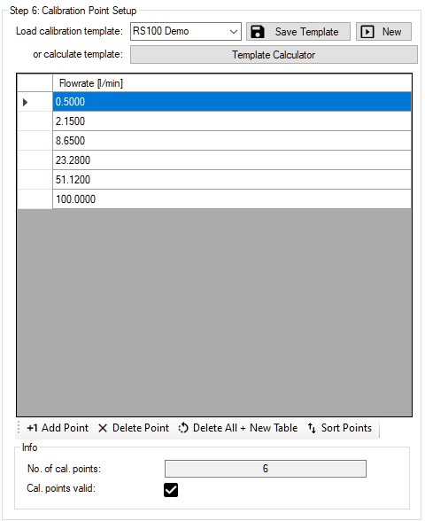
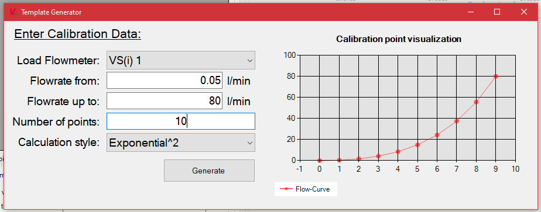
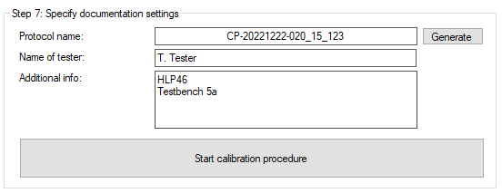

# Calibration setup

### Navigation

The setup is designed like a step-by-step assistant which will guide you through the calibration and documentation procedure. 
Use the buttons at the top to navigate between pages. The software will tell you, if you missed something along the way.


### :material-crown:  Master setup
On the master setup page all settings regarding the master flowmeter such as linearization data and IPF are set. 
Also the power supply will be checked and a datastorage path must be specified, where the result files will be automatically saved.  
#### Step 1: Load Master Calibration Data


The master flowmeter type and serial number are queried for documentation purposed because they are shown on the generated calibration protocol. The IPF is used for the calculation of the measured pulses and should match with the frequencies and K-Factors of the corresponding linearization table. 

With the port config the measurement principle of the Cal.flow will be configured. You can use the two channel evaluation (_default_) for most flowmeters. For certain one-channel flowmeters (EF/VHM) you have to specify the input pin. Please also read the [notes regarding PNP/NPN signals](basics.md#m12-input-signals) for these flowmeter output types.

**Linearization table**



The linearization table can be entered manually or copy-pasted from a Microsoft Word or Excel based table in a matching format. The 'paste command' will paste from the last selected cell, so please left click on the 'top-left' cell where the paste should start. After pasting use the ```Sort Points``` button to bottom align the points.
The frequencies and K-Factor should be matching the flowmeter's interpolation factor.

!!! info "Preset save info"

    The linearization table is saved alongside with the master preset even though it is not inside the same groupbox.

!!! tip

    Please note that only two columns need to be entered into the linearization table. The third column can be calculated from the two other ones by clicking the corresponding calculation button (see image).


#### Step 2: Power supply for flowmeters


For the power supply, the user can choose between 3 options:

* **Option 1:** Use of a M12 T-Connector to inject 24V into one of the flowmeter cables. The power supply is then bridged to the other flowmeter. No voltage check is performed by the Cal.flow, if using this option.
* **Option 2:** Use of an external 24V power supply and connecting it on the DC power jack input. The connection status of the plug will be shown in the status box. 

!!! warning inline end "Don't use boost with 2x TB2" 

    The power draw of two VSE TestBox 2 devices is too big to be driven with the internal boost converter. Use the external power supply!
* **Option 3:** Use of the internal 5V to 24V boost converter. It can be toggled using the corresponding button next to the status box. No additional power supplied need to be connected. The flowmeter supply current will be drawn from the PC's USB port. To avoid overheating and damage of the Cal.flow a maximum combined current draw of 50mA @ 24V of both flowmeters is allowed. If the internal boost converter is active while plugging the DC jack in, the boost converter is automatically switched off.

#### Step 3: Fluid specification


The calibration viscosity and temperature of the fluid have to be specified as they also appear on the calibration procotol. These values can also be saved as a seperate preset to be used in other calibrations. 

#### :material-test-tube: Step 4: DUT setup



Using the ```DUT setup``` tab the test flowmeter is specified. This step is comparable with [step 1](program.md#step-1-load-master-calibration-data) - but this time the DUT data has to be specified. Again, the flowmeter type and serial number are queried for documentation on the calibration protocol. The approximate or nominal K-Factor (including IPF) is used to calculate the flowrate from the measured frequency, so that the right value is shown in the live plot. For VSE flowmeters, the K-Factor can be looked up using the ```Look up``` button. Alternatively you can also measure the approximate value using the ```Measure``` button and a steady flow through both flowmeters. The flowrate will then be calculated using the current frequency values of both flowmeters. Look at the live plot to verify that the selected input port configuration for the DUT is correct.


#### Step 5: Measurement configuration


##### Description of the calibration procedure
The calibration procedure will request the tester to manually set the flowrate to each of the specified [calibration points](program.md#calibration-point-setup). When the actual flowrate of the master is inside the flowrate hysteresis window of the requested value, a steadyness check will be performed for a specified duration. During this time, the flowrate must not exceed the hysteresis window, else the steadyness counter will be reset. After the steadyness check is successful, the software will start counting the pulses of both flowmeters and perform a K-Factor calculation. The software will then request the user to set the flow for the next calibration point. This cycle repeats until all calibration points for all calibration cycles are measured. After this, the protocol can be generated.

##### Pulse counting and calibration setup
The following parameters can be configured:

**Parameter** | **Description**
--- | ---
Number of cycles | Number of times, the measurement of all calibration points is repeated. A minimum value of ```2``` is necessary for the calculation of the reproducibility.
Number of gear teeth / pulses | Number of measured gear teeth / pulses (≙ non-interpolated rising signal edges of one channel). The higher the value, the more accurate the results are. Please note that the measure time for each point also rises. The total number of measured signal edges will be internally calculated based on the IPF and the port config of each channel.
Resulting fluid volume | Informative value that shows the volume that corresponds to the target pulse count.
Time limit | The maximum point calibration time can be limited by this value (Unit: seconds). The total number of signal edges will then be cropped so they fit into the specified time frame. Use this feature if the measurement time is very long with low flowrates. The use of this feature may decrease the accuracy of the calculated K-Factor. Setting the value to zero, disables the time limit. This will prohibit the cropping of the total number of signal edges and result in a constant measurement accuracy.

##### Advanced Measurement Settings 

**Parameter** | **Description**
--- | ---
Minimum measurement time | Counterpart of ```time limit```: Especially if high frequencies are measured, a value `>0` will make sure that at least the specified duration will be measured. Set to `0` to disable this feature.
Flow steady time | Steadyness check: The flowrate needs to be steady for this duration to start the measurement (Unit: seconds).
Flow steady hysteresis | Steadyness check: The flowrate needs to be steady in this flowrate region to start the measurement (Unit: % of Q).
Minimum flow hysteresis | Steadyness check: Limit the minimum hysteresis that is being calculated from the ```Flow steady hysteresis``` percentage. This is useful if the flow is pulsating or cannot be set with enough precision. This feature can be disabled by entering ```0```. This value should be set based on how precisely you can adjust the flowrate of your calibration system with low flowrates.
Maximum flow hysteresis | Steadyness check: Limit the maximum hysteresis that is being calculated from the ```Flow steady hysteresis``` percentage. This is useful if you want to set exact calibration points even in the higher flowrange. This feature can be disabled by entering ```0```. This value should be set based on how precisely you can adjust the flowrate of your calibration system with high flowrates.

##### Step 6: Calibration point setup


The calibration points are the flowrates that will be tested in the calibration procedure. At least one point has to be specified. The values can either be added manually using the four buttons at the bottom of the table or calculated automatically using the [template generator](program.md#template-generator). 

##### Template Generator


The template generator allows the user to calculate a specified number of calibration points in a custom range of flowrates. If a VSE flowmeter is going to be calibrated, the  min. and max. flowrate values can be looked up to fill in the input fields. After this, the values can be manually adjusted to the preferred flow range. There are three calculation styles for the distribution of the calibration points:

**Calculation style** | **Explaination**
--- | ---
Linear | Even distribution of the calibration points in the specified interval
Exponential | Use of a exponential function to distribute the calibration points. This shifts more points into the lower flow range where the flowmeter accuracy is non-linear and more points are needed to describle it's characteristic curve.
Exponential^2 | Applies the exponential function a second time for even stronger points redistribution into the lower range.

#### Step 7: Output Directory for calibration protocols


In this step the directory for the storage of all calibration results needs to be specified. The folder path will be automatically saved for all following program startups. The directory that is being specified will be the root directory of the following directory-structure:

```
├── root directory
│   ├── YYYY-MM (year and month directory)
│   │   ├── CP-*.xml (calibration data file)
```

#### Step 8: Specify documentation settings


In this step, the protocol name needs to be specified. If the name is not important, it can be automatically generated from the DUT serial number and the current date. If no name is entered and the calibration is started, the program askes again to generate a name automatically. 

Futhermore the test person's name is queried because it is written onto the calibration protocol. A list of recent names is saved in the auto-complete history of the field. 

The 'Additional info' field allows the tester to specify the measurement more in-depth. The text will also be shown on the calibration protocol. 

!!! tip 

    The name of the test person and the contents of the 'Additional info' field can also be changed later during the report generation.


#### Starting the measurement

To start the measurement, use the ```Next step``` button. The software will check all entered values for validness beforehand. If a message box is displayed, follow the hints to solve the problem before proceeding.

[:material-arrow-right: Go to next chapter](procedure.md#calibration)


